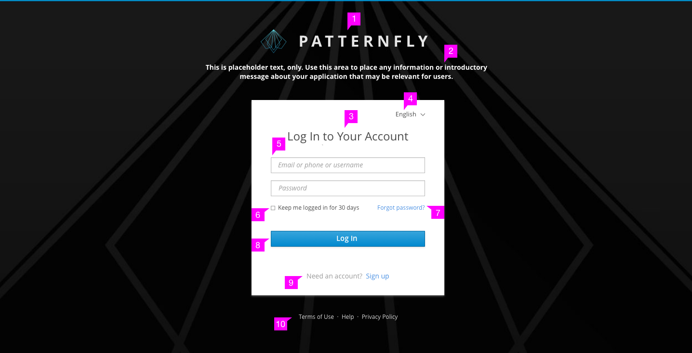
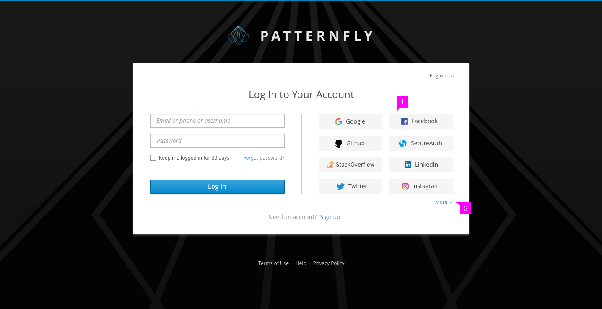
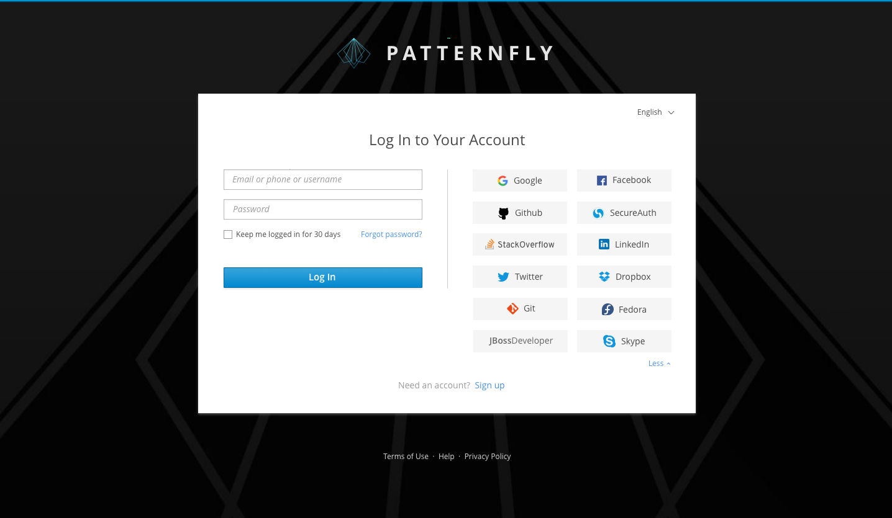
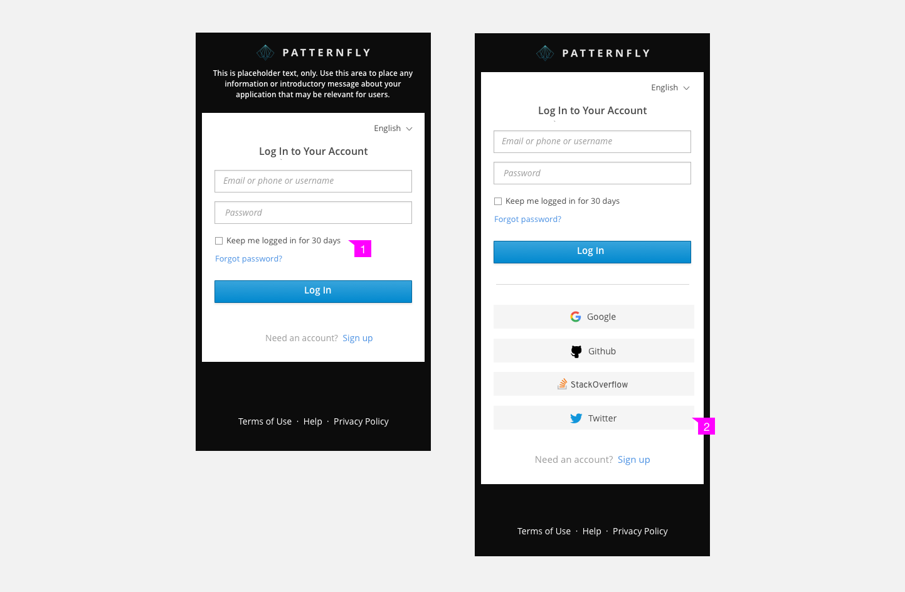
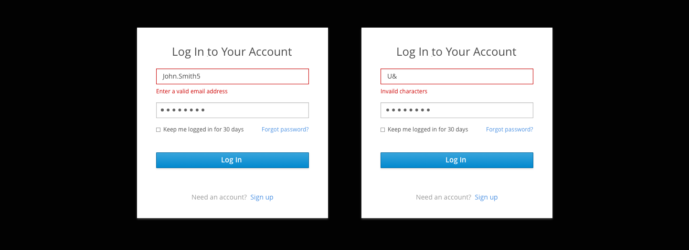
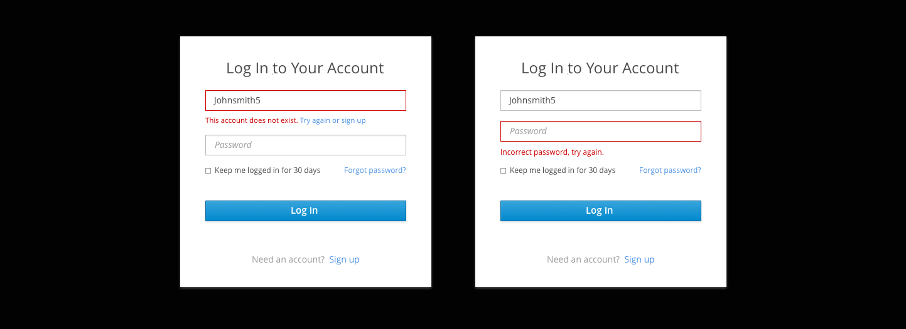
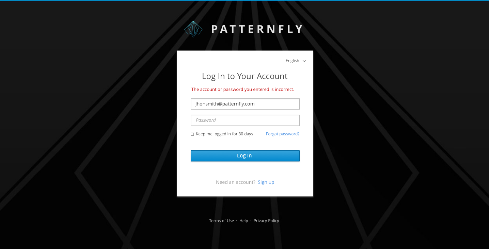
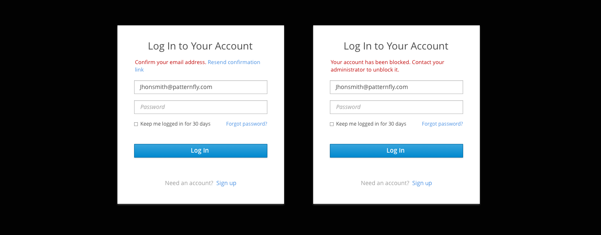
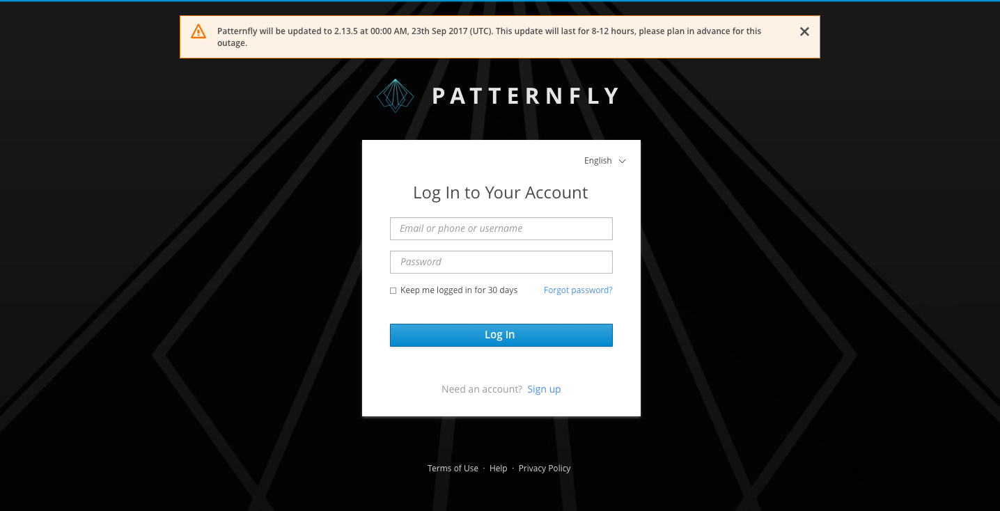

# Login Page

Jump to [Login Pages](#login-pages), [Login Pages \| Responsive State](#login-pages--responsive-state), [Error Messages](#error-messages), or [Notifications](#notifications)

## Login Pages

### Basic Login Page

1. **Logotype**: The product logo is placed at the top.
2. **Description** (optional): Description of the website can be placed here.
3. **Title**: The title is located at the top of the login card. "Your Account" can be replaced with any word that makes sense for the application.
4. **Language Selector** (optional): The language selector is located in the top right of the login card.
5. **Required Fields**: Username and password are the required fields while additional fields are optional. Some applications may require additional fields such as a specific server or geo-location. When additional fields are required, they should be ordered on a case-by-case basis and placed directly below the password field. The login card will expand to accommodate the additional fields.
Try to limit the total number of fields to less than five. Also, you may use progressive disclosure if the field value have dependency on the previous relevant field.
6. **Checkbox** (optional): A checkbox is located under the required (and any additional) fields, and is labeled based on the needs of the application. Checkbox labels should use sentence style capitalization according to the [Terminology and Wording Style Guide](http://www.patternfly.org/styles/terminology-and-wording/).
7. **Help Link** (optional): A help link should take users to a page where they can recover their password.
8. **Login Button**: The button should be labeled "Log In". See "[Common Terms and Words](http://www.patternfly.org/styles/terminology-and-wording/#common-terms-and-words)" on the Terminology and Wording Style Guide for more information.
9. **Sign up** (optional): The page will jump to the sign up flow after clicking the “Sign up” link.
10. **Links** (optional): You may add any additional links to pages where the user can get more information or help.

### Social Login

1. **Social Media Buttons**: When the number of buttons is four or less, display all buttons in one column. Otherwise, use a two-column layout. All the buttons should be listed in the order of their mostly likely usage, that is, the most frequently used items should show at or near the top of the list.
2. **More Link**: When there are more than 8 buttons, a more link will show below the grid on 8 buttons. User can click the link to expand the button grid and the link will change to "less".

## Login Pages | Responsive State
This section describes how the login pages should look on small screens.

1. When the screen gets smaller, the help link will automatically move to the next line if there isn’t enough space for the checkbox and the help link to be placed in the same line.
2. In the responsive state, all the social media buttons stack in a single column.

## Error Messages
User input can be validated on the client or on the server. With client-side validation, error message will be presented before the form is submitted. It could happen when a text field gains focus, loses focus, or when user clicks the action button (without calling backend authenticator). With server-side validation, error message will only be presented when the page is reloaded with the data user submitted.

Jump to [Client-side Errors](#client-side-errors) or [Server-side Errors](#server-side-errors)

### Client-side Errors
In most cases, client-side validations are performed as inline validations for each field. Some common conditions are as follows.

#### Field(s) is empty

1. **When to Show**: When the user clicks the action button (Log In/Next), the errors must be corrected before the form can be submitted, and an error message will be displayed below any empty field.
2. **When to Hide**: When the user fills the empty field, the error message will disappear when the field loses focus.
3. **Recommended Message**:
  - When the username field is empty, we recommend to show “Enter your email or phone or username”. Email/phone/username can be restricted to specific types according to the target application.
  - When the password field is empty, we recommend to show “Enter your password” if a password is needed.

#### Invalid Characters

1. **When to Show**: When user clicks the action button (Log in/Next), the login form can’t be submitted and error message will show (below the username field) if there are invalid characters in username.
2. **When to Hide**: After user modified the field, the error message will disappear when the field loses focus.
3. **Recommended Message**:
	- What characters are invalid determined by the username type: email address, phone number or custom username.
	- If the username can only be email address/phone number, we recommend to show “Enter a valid email address/phone number” when there are invalid characters.
	- If the username can also be customized, when there are invalid characters, show “Invalid characters”.

#### Caps lock is on

1. **When to Show**: When the password field gets focus as well as caps lock is on, an error message will show up to warn users to avoid making mistake.
2. **When to Hide**: Once the caps lock turns off, the warning message should disappear.
3. **Recommended Message**: "Caps lock is currently on. This may cause you to type an incorrect password."

### Server-side Errors
When users submit the form, the entire page is reloaded if there are validation errors. At the same time, the password field should be cleared due to the security reason. Error messages can appear as inline errors for each field or as inline notifications. Inline Notifications are displayed below the application name and above the input fields. If there are multiple messages, each message appears on its own line, and the area adjusts as needed to fit these messages.

#### Account doesn’t exist/password is wrong
If the user input a wrong account name which do not exist or if the user input a wrong password, we provide two solutions to show error messages:

1. Directly tell the user that the account doesn’t exist or the password is wrong. Although this approach is useful and clear for user, it's not recommended if protecting identity of valid users is important.

 - When username is wrong (doesn’t exist), we recommend to show “The account does not exist. Try again or sign up”. The “sign up” should be a link to help users creating a new account much easier.
 - When password is wrong, we recommend to show “Incorrect password, try again.” If the user inputs an old password (they may have changed the password recently), we can show an error message alerting them that the password has changed instead of stating “the password is wrong” only.
 

2. For security reasons, just tell user that the username and the password don’t match.

#### Other Examples of Error Messages

## Notifications
Except for error messages, notifications can also be warning messages. A warning message can be triggered by system level events or triggered if the user is timed out of the application. The user can dismiss the notification by clicking on the close icon.

