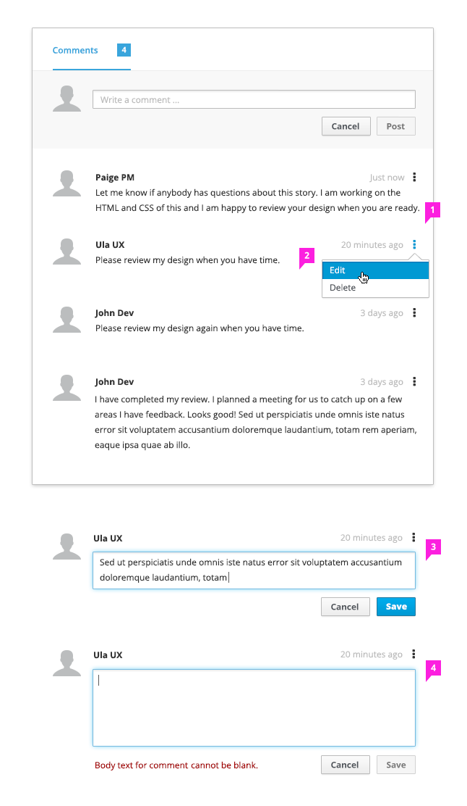
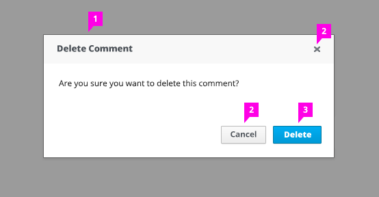

# Comments

## Creating and viewing comments

1. **Header:** The Comments header tallies the total comments. There is no known limit to the number of comments.
2. **Commenting entry field:** Static text in the comment field will instruct the user on entering comments into the field.
3. **Comments:** The individual comment entered will contain;
  - Users Avatar on Comment - a default avatar should be provided. (Optional: Avatar displayed with the commenting entry field)
  -  Name
  - Date and time stamp, for when the comment was entered or last modified. (Time date stamp presentation may vary on usage to match time date stamp system of existing application.)
  - Text for the comment.
  - The order of the list of comments will be latest to oldest, from top to bottom, by default. The order of the list may be reviewed, to determine if the environment in which it is used, would best support latest to last or last to latest.
  **Buttons**
   - (optional)The appearance of the buttons as text or icons.
   - (optional) Placement of the command buttons below or to the right of the text entry field.
   - (optional) Cancel button is optional, as backspace can achieve the same effect, it just will most likely require more keystrokes.

## Interactions and Behaviors for entering a comment

1. Once the comment field has focus:
   - The Cancel and Post buttons will display and the instructional text will clear, displaying a blinking cursor.
   - The post button will be disabled.
   - Once at least one character has been entered into the field, the Post button will enable.
   - If the text entry field has no text and or has lost focus, the instructional text will reappear and the post button will disable.
2. Color: Any text entered will be black
3. Text Behavior: Comments will infinitely wrap to accommodate the text. The Post button will remain bottom aligned with the commenting text field, as it grows.
4. Alignment: The comments will be left aligned and extend out to the right most margin and then carriage return/wrap.
5. Key Commands: “Return” to force a carriage return, “Esc” to Cancel the comment.

## Edit + Delete comments

1. **Menu commands:** The kebab menu will house the commands for the comment, such as, Edit and Delete.
2. **Delete command:** Selecting the Delete command prompts the user with a confirmation
dialog. Selecting the Edit command, will place the comment into and editing mode.
3. **Edit a comment:** When a Comment is in Edit mode, the text field will highlight and become an in - line editable area. The cursor will blink and have focus at the end of the current string of text. There will be Save and Cancel buttons.
5. **Empty comment field:** If the user removes all of the text, from the comment, and clicks the Save button, the user will receive an in line message “Body text for comment, cannot be blank.”

## Completion Page

1. **Displays when:** Delete dialog displays, after a the Delete command has been selected from the kebab menu on a comment.
2. **Cancel actions::** Cancel button and “X” both close the dialog and dismiss any changes.
3. **Delete actions:** Delete is the default command
4. **Keyboard commands:** The Esc key will also dismiss the action. The Return key will accept the Delete action.
5. **Other actions:** Clicking outside of the dialog will dismiss the action and the dialog.

### What’s not covered in the current design but will be covered in future sprints:

The following functionality is not covered in this pattern:

1. Scrolling, as this action should be suitable to how and where comments are utilized. The comments may have a scroll bar or may be infinite scroll, depending upon how they are being used.
2. Replying to a comment or threading a comment has not yet been designed it this basic commenting pattern.
3. Attachments has not been designed into this basic pattern.
4. We have only provided placement of the Time and date stamp format and rules, as requirements for these can greatly vary.
