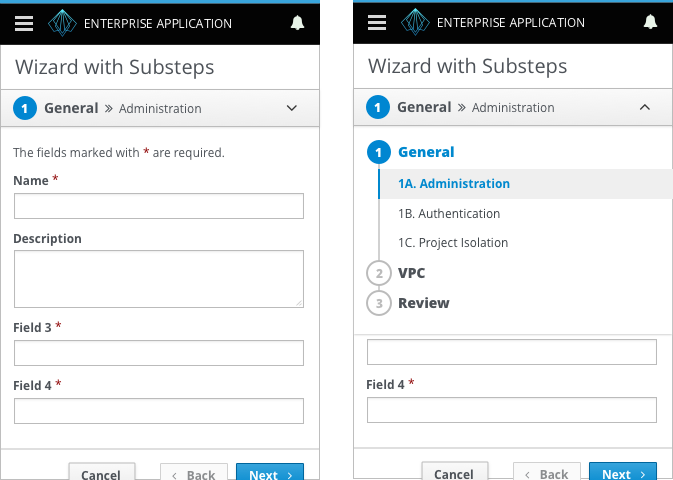

# Wizard

Wizards should be used when the user needs to go through a sequential set of steps to complete a task. A wizard is a good way to break a complex task into sub-tasks that can be more readily understood and completed. More complex wizards can have branching which takes the user to a different step depending on their settings/answers to previous questions. Wizards may appear as a modal, or be embedded in a page.

## Modal Wizard

<!---
7Feb2018:
Removing Embedded Wizard from this pattern for now. The main issue with this design is the full height. This can only be done if we can know the height of all the other elements on the page with the wizard. So for example: wizard height = (100 % of viewport height - combined height of other elements). If we build the example and another element is added it will break.

## Embedded Wizard

--->

## Wizard Mobile View

